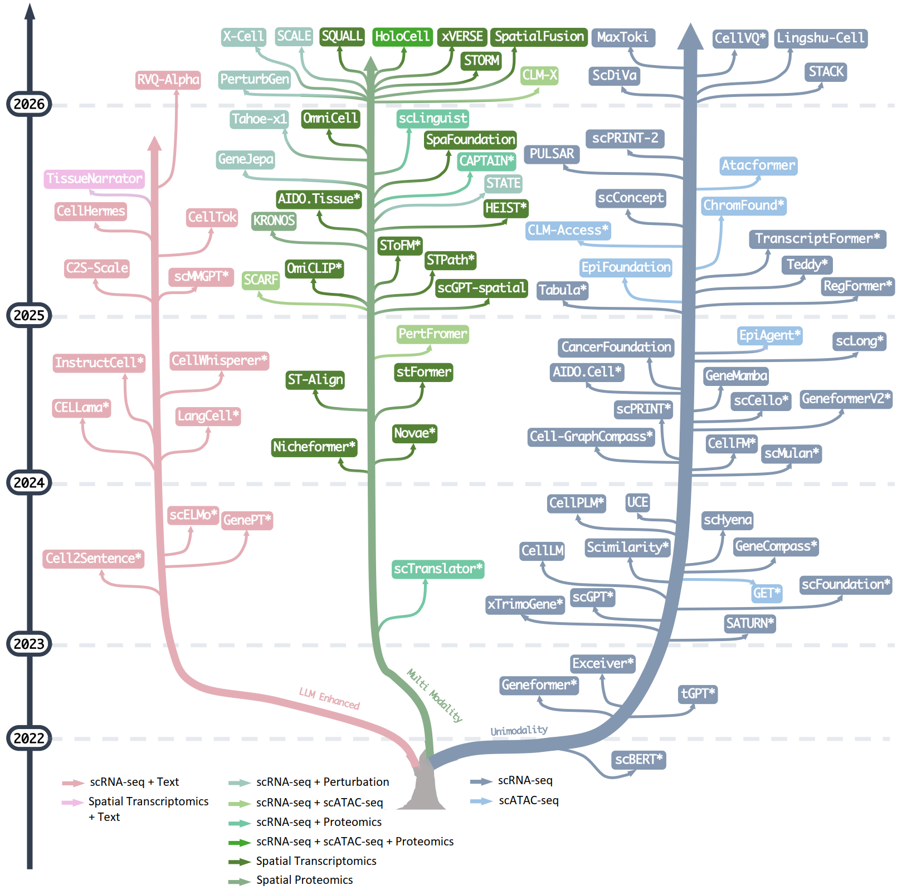

<h1 align="center">Awesome Foundation Models for Single-Cell</h1>

	
	
	
	

A curated, continuously updated reading list of <b>foundation-model</b> research for <b>single-cell genomics</b>. The structure follows our review <b><i>"The landscape of single-cell foundation models: design principles, applications, and open challenges"</i></b>: single-cell foundation models are organized into <b>unimodal</b>, <b>multimodal</b>, and <b>LLM-based</b> scFMs, and the surrounding literature is grouped into perturbation modeling, virtual cells, pretraining datasets, benchmarks, infrastructure & agents, and surveys.

Contributions are very welcome! Found a paper we missed, or a broken link? Open an issue or a pull request.

  Evolutionary tree credit: <a href="https://github.com/Mooler0410/LLMsPracticalGuide/tree/main">Mooler0410/LLMsPracticalGuide</a>

  

## Catalog
- [Catalog](#catalog)
- [Single-Cell Foundation Models](#single-cell-foundation-models)
  - [Unimodal scFMs](#unimodal-scfms)
    - [scRNA-seq](#scrna-seq)
    - [scATAC-seq](#scatac-seq)
  - [Multimodal scFMs](#multimodal-scfms)
    - [Transcriptomics and Perturbation](#transcriptomics-and-perturbation)
    - [Spatial, Proteomics and Histology](#spatial-proteomics-and-histology)
    - [Multi-omics: RNA, ATAC and Protein](#multi-omics-rna-atac-and-protein)
  - [LLM-based scFMs](#llm-based-scfms)
- [Genetic Perturbation: Models, Atlases and Benchmarks](#genetic-perturbation-models-atlases-and-benchmarks)
  - [Models and prediction frameworks](#models-and-prediction-frameworks)
  - [Perturbation atlases and datasets](#perturbation-atlases-and-datasets)
  - [Perturbation benchmarks](#perturbation-benchmarks)
- [Virtual Cell, World Models and Digital Human](#virtual-cell-world-models-and-digital-human)
  - [Reviews, comments, and perspectives](#reviews-comments-and-perspectives)
  - [Models and frameworks](#models-and-frameworks)
- [Pretraining Datasets and Resources](#pretraining-datasets-and-resources)
  - [Single-cell transcriptomic atlases and repositories](#single-cell-transcriptomic-atlases-and-repositories)
  - [Multimodal and spatial pretraining corpora](#multimodal-and-spatial-pretraining-corpora)
  - [Data formats and frameworks](#data-formats-and-frameworks)
- [Benchmarks and Evaluation](#benchmarks-and-evaluation)
  - [Benchmarks and critical evaluations](#benchmarks-and-critical-evaluations)
  - [Data privacy and accessibility](#data-privacy-and-accessibility)
- [Infrastructure, Platforms and AI Agents](#infrastructure-platforms-and-ai-agents)
  - [Infrastructure and platforms](#infrastructure-and-platforms)
  - [AI agents for single-cell discovery](#ai-agents-for-single-cell-discovery)
  - [Lab-in-the-loop and active discovery](#lab-in-the-loop-and-active-discovery)
- [Surveys and Perspectives](#surveys-and-perspectives)
- [Foundation Models for Pathology (related work)](#foundation-models-for-pathology-related-work)

## Single-Cell Foundation Models

Single-cell foundation models are pretrained on large-scale atlases to learn transferable representations of cellular state. Following the review, they are grouped by the modalities they are pretrained on: **unimodal** (a single omic), **multimodal** (jointly modeling transcriptomic, epigenomic, proteomic and/or spatial measurements), and **LLM-based** (incorporating large language models or textual biological knowledge).

### Unimodal scFMs

Models trained within a single omic modality (scRNA-seq or scATAC-seq), learning representations through masked reconstruction, autoregressive generation, contrastive/relational alignment, or supervised prediction.

#### scRNA-seq
1. [2026 bioRxiv] **MaxToki: Temporal AI model predicts drivers of cell state trajectories across human aging** [[paper]](https://www.biorxiv.org/content/10.64898/2026.03.30.715396v1)
1. [2026 arXiv] **Lingshu-Cell: A generative cellular world model for transcriptome modeling toward virtual cells** [[paper]](https://arxiv.org/abs/2603.25240)
1. [2026 Nature Communications] **CellVQ: Illuminating cell states by a comprehensive and interpretable single cell foundation model** [[paper]](https://www.nature.com/articles/s41467-026-70071-5)
1. [2026 arXiv] **ScDiVa: Masked discrete diffusion for joint modeling of single-cell identity and expression** [[paper]](https://arxiv.org/abs/2602.03477)
1. [2026 arXiv] **Cell-JEPA: Latent Representation Learning for Single-Cell Transcriptomics** [[paper]](https://arxiv.org/abs/2602.02093)
1. [2026 bioRxiv] **Stack: In-Context Learning of Single-Cell Biology** [[paper]](https://www.biorxiv.org/content/10.64898/2026.01.09.698608v1)
1. [2026 Nature Communications] **scLong: A Billion-Parameter Foundation Model for Capturing Long-Range Gene Context in Single-Cell Transcriptomics** [[paper]](https://www.nature.com/articles/s41467-026-69102-y)
1. [2026 Nature Communications] **RegFormer: a single-cell foundation model powered by gene regulatory hierarchies** [[paper]](https://www.nature.com/articles/s41467-026-72198-x)
1. [2026 Nature Computational Science] **GeneformerV2: Scaling and quantization of a large-scale foundation model enables resource-efficient predictions in network biology** [[paper]](https://www.nature.com/articles/s43588-026-00972-4)
1. [2026 ICML] **Scalable Single-Cell Gene Expression Generation with Latent Diffusion Models** [[paper]](https://arxiv.org/abs/2511.02986)
1. [2025 bioRxiv] **scPRINT-2: Towards the next-generation of cell foundation models and benchmarks** [[paper]](https://www.biorxiv.org/content/10.64898/2025.12.11.693702v1)
1. [2025 bioRxiv] **Towards foundation models that learn across biological scales** [[paper]](https://www.biorxiv.org/content/10.1101/2025.05.16.653447v2.abstract)
1. [2025 bioRxiv] **PULSAR: a Foundation Model for Multi-scale and Multicellular Biology** [[paper]](https://www.biorxiv.org/content/10.1101/2025.11.24.685470v1)
1. [2025 bioRxiv] **scConcept: Contrastive pretraining for technology-agnostic single-cell representations beyond reconstruction** [[paper]](https://www.biorxiv.org/content/10.1101/2025.10.14.682419v1)
1. [2025 Nature Machine Intelligence] **Harnessing the power of single-cell large language models with parameter-efficient fine-tuning using scPEFT** [[paper]](https://www.nature.com/articles/s42256-025-01170-z)
1. [2025 Nature Methods] **scNET: learning context-specific gene and cell embeddings by integrating single-cell gene expression data with protein–protein interactions** [[paper]](https://www.nature.com/articles/s41592-025-02627-0)
1. [2025 Science] **TranscriptFormer: A Cross-Species Generative Cell Atlas Across 1.5 Billion Years of Evolution** [[paper]](https://www.science.org/doi/10.1126/science.aec8514)
1. [2025 arXiv] **TEDDY: A Family of Foundation Models for Understanding Single Cell Biology** [[paper]](https://arxiv.org/abs/2503.03485)
1. [2025 NeurIPS] **Tabula: A Tabular Self-Supervised Foundation Model for Single-Cell Transcriptomics** [[paper]](https://openreview.net/forum?id=Vk2sfKAdeu)
1. [2025 Nature Communications] **scPRINT: pre-training on 50 million cells allows robust gene network predictions** [[paper]](https://www.nature.com/articles/s41467-025-58699-1)
1. [2025 Nature Communications] **CellFM: a large-scale foundation model pre-trained on transcriptomics of 100 million human cells** [[paper]](https://www.nature.com/articles/s41467-025-59926-5)
1. [2025 National Science Review] **Cell-GraphCompass: Modeling Single Cells with Graph Structure Foundation Model** [[paper]](https://academic.oup.com/nsr/article/12/10/nwaf255/8172492)
1. [2025 Nature] **SCimilarity: A cell atlas foundation model for scalable search of similar human cells** [[paper]](https://www.nature.com/articles/s41586-024-08411-y)
1. [2025 arXiv] **GeneMamba: Bidirectional Mamba for Single-Cell Data — Efficient Context Learning with Biological Fidelity** [[paper]](https://arxiv.org/abs/2504.16956)
1. [2024 bioRxiv] **CancerFoundation: A single-cell RNA sequencing foundation model to decipher drug resistance in cancer** [[paper]](https://www.biorxiv.org/content/10.1101/2024.11.01.621087v1)
1. [2024 bioRxiv] **AIDO.Cell: Scaling Dense Representations for Single Cell with Transcriptome-Scale Context** [[paper]](https://www.biorxiv.org/content/10.1101/2024.11.28.625303v1)
1. [2024 NeurIPS] **scCello: Cell-ontology guided transcriptome foundation model** [[paper]](https://neurips.cc/virtual/2024/poster/94537)
1. [2024 RECOMB] **scMulan: a multitask generative pre-trained language model for single-cell analysis** [[paper]](https://link.springer.com/chapter/10.1007/978-1-0716-3989-4_57)
1. [2024 Nature Methods] **scGPT: toward building a foundation model for single-cell multi-omics using generative AI** [[paper]](https://www.nature.com/articles/s41592-024-02201-0)
1. [2024 Nature Methods] **scFoundation: Large Scale Foundation Model on Single-cell Transcriptomics** [[paper]](https://www.nature.com/articles/s41592-024-02305-7)
1. [2024 Nature Methods] **SATURN: Toward universal cell embeddings — integrating single-cell RNA-seq datasets across species** [[paper]](https://www.nature.com/articles/s41592-024-02191-z)
1. [2024 Nature Methods] **scPROTEIN: a versatile deep graph contrastive learning framework for single-cell proteomics embedding** [[paper]](https://www.nature.com/articles/s41592-024-02214-9)
1. [2024 Cell Research] **GeneCompass: Deciphering Universal Gene Regulatory Mechanisms with Knowledge-Informed Cross-Species Foundation Model** [[paper]](https://www.nature.com/articles/s41422-024-01034-y)
1. [2024 bioRxiv] **Large-scale characterization of cell niches in spatial atlases using bio-inspired graph learning** [[paper]](https://www.biorxiv.org/content/10.1101/2024.02.21.581428v1)
1. [2024] **scmFormer Integrates Large-Scale Single-Cell Proteomics and Transcriptomics Data by Multi-Task Transformer** [[paper]](https://pubmed.ncbi.nlm.nih.gov/38483032/)
1. [2024] **Single-cell metadata as language** [[paper]](https://www.nxn.se/valent/2024/2/4/single-cell-metadata-as-language)
1. [2024 ICLR] **CellPLM: Pre-training of Cell Language Model Beyond Single Cells** [[paper]](https://openreview.net/forum?id=BKXvPDekud)
1. [2023 bioRxiv] **UCE: Universal Cell Embeddings — A Foundation Model for Cell Biology** [[paper]](https://www.biorxiv.org/content/10.1101/2023.11.28.568918v1)
1. [2023 Nature] **Geneformer: Transfer learning enables predictions in network biology** [[paper]](https://www.nature.com/articles/s41586-023-06139-9)
1. [2023 NeurIPS] **xTrimoGene: An Efficient and Scalable Representation Learner for Single-Cell RNA-Seq Data** [[paper]](https://openreview.net/forum?id=gdwcoBCMVi)
1. [2023 iScience] **tGPT: Generative pretraining from large-scale transcriptomes for single-cell deciphering** [[paper]](https://www.cell.com/iscience/fulltext/S2589-0042(23)00613-2)
1. [2023 Nature Methods] **scPoli: Population-level integration of single-cell datasets enables multi-scale analysis across samples** [[paper]](https://www.nature.com/articles/s41592-023-02035-2)
1. [2023 NeurIPS] **MuSe-GNN: Learning Unified Gene Representation From Multimodal Biological Graph Data** [[paper]](https://openreview.net/forum?id=4UCktT9XZx)
1. [2023 NeurIPS Workshop] **Single-cell Masked Autoencoder: An Accurate and Interpretable Automated Immunophenotyper** [[paper]](https://openreview.net/pdf?id=2mq6uezuGj)
1. [2023 bioRxiv] **Large-Scale Cell Representation Learning via Divide-and-Conquer Contrastive Learning** [[paper]](https://arxiv.org/pdf/2306.04371.pdf)
1. [2023 bioRxiv] **CellPolaris: Decoding Cell Fate through Generalization Transfer Learning of Gene Regulatory Networks** [[paper]](https://www.biorxiv.org/content/10.1101/2023.09.25.559244v1)
1. [2023 bioRxiv] **scHyena: Foundation Model for Full-Length Single-Cell RNA-Seq Analysis in Brain** [[paper]](https://arxiv.org/abs/2310.02713)
1. [2022 Nature Machine Intelligence] **scBERT as a large-scale pretrained deep language model for cell type annotation of single-cell RNA-seq data** [[paper]](https://www.nature.com/articles/s42256-022-00534-z)
1. [2022 arXiv] **Exceiver: A single-cell gene expression language model** [[paper]](https://arxiv.org/abs/2210.14330)
1. [2022 Bioinformatics] **scPretrain: multi-task self-supervised learning for cell-type classification** [[paper]](https://academic.oup.com/bioinformatics/article/38/6/1607/6499287)

#### scATAC-seq
1. [2025 bioRxiv] **Atacformer: A transformer-based foundation model for analysis and interpretation of ATAC-seq data** [[paper]](https://www.biorxiv.org/content/10.1101/2025.11.03.685753v1)
1. [2026 AAAI] **CLM-Access: A specialized foundation model for high-dimensional single-cell ATAC-seq analysis** [[paper]](https://ojs.aaai.org/index.php/AAAI/article/view/37046)
1. [2025 NeurIPS] **ChromFound: Towards A Universal Foundation Model for Single-Cell Chromatin Accessibility Data** [[paper]](https://arxiv.org/abs/2505.12638)
1. [2025 bioRxiv] **EpiFoundation: A Foundation Model for Single-Cell ATAC-seq via Peak-to-Gene Alignment** [[paper]](https://www.biorxiv.org/content/10.1101/2025.02.05.636688v2)
1. [2025 Nature Methods] **EpiAgent: foundation model for single-cell epigenomics** [[paper]](https://www.nature.com/articles/s41592-025-02822-z)
1. [2025 Nature] **GET: A foundation model of transcription across human cell types** [[paper]](https://www.nature.com/articles/s41586-024-08391-z)

### Multimodal scFMs

Models that jointly encode complementary modalities — transcriptomic, epigenomic, proteomic, perturbational and spatial — through modality-specific reconstruction, cross-modality alignment, or task-informed supervision.

#### Transcriptomics and Perturbation
1. [2026 bioRxiv] **X-Cell: Scaling Causal Perturbation Prediction Across Diverse Cellular Contexts via Diffusion Language Models** [[paper]](https://www.biorxiv.org/content/10.64898/2026.03.18.712807v1)
1. [2026 arXiv] **SCALE: Scalable conditional atlas-level endpoint transport for virtual cell perturbation prediction** [[paper]](https://arxiv.org/abs/2603.17380)
1. [2026 bioRxiv] **PerturbGen: Predicting how perturbations reshape cellular trajectories** [[paper]](https://www.biorxiv.org/content/10.64898/2026.03.04.709254v1)
1. [2025 bioRxiv] **GeneJepa: A Predictive World Model of the Transcriptome** [[paper]](https://www.biorxiv.org/content/10.1101/2025.10.14.682378v1)
1. [2025 bioRxiv] **Tahoe-x1: Scaling Perturbation-Trained Single-Cell Foundation Models to 3 Billion Parameters** [[paper]](https://www.biorxiv.org/content/10.1101/2025.10.23.683759v1)
1. [2025 bioRxiv] **STATE: Predicting cellular responses to perturbation across diverse contexts** [[paper]](https://www.biorxiv.org/content/10.1101/2025.06.26.661135v2)

#### Spatial, Proteomics and Histology
1. [2026 bioRxiv] **Integrating Histology with Spatial Molecular Programs Using a Multimodal Foundation Model** [[paper]](https://www.biorxiv.org/content/10.64898/2026.06.01.729028v1)
1. [2026 Nature Medicine] **HEX: AI-enabled virtual spatial proteomics from histopathology for interpretable biomarker discovery in lung cancer** [[paper]](https://www.nature.com/articles/s41591-025-04060-4)
1. [2026 bioRxiv] **xVERSE: A transcriptomics-native foundation model for universal cell representation and virtual cell synthesis** [[paper]](https://www.biorxiv.org/content/10.64898/2026.04.12.718016v1)
1. [2026 arXiv] **STORM: A Multimodal Foundation Model of Spatial Transcriptomics and Histology for Biological Discovery and Clinical Prediction** [[paper]](https://arxiv.org/abs/2604.03630)
1. [2026 bioRxiv] **SpatialFusion: A lightweight multimodal foundation model for pathway-informed spatial niche mapping** [[paper]](https://www.biorxiv.org/content/10.64898/2026.03.16.712056v1)
1. [2025 arXiv] **HEIST: A graph foundation model for spatial transcriptomics and proteomics data** [[paper]](https://arxiv.org/abs/2506.11152)
1. [2025 arXiv] **KRONOS: A Foundation Model for Spatial Proteomics** [[paper]](https://arxiv.org/abs/2506.03373)
1. [2025 arXiv] **SPATIA: Multimodal Generation and Prediction of Spatial Cell Phenotypes** [[paper]](https://arxiv.org/abs/2507.04704)
1. [2025 bioRxiv] **OmniCell: Unified Foundation Modeling of Single-Cell and Spatial Transcriptomics for Cellular and Molecular Insights** [[paper]](https://www.biorxiv.org/content/10.64898/2025.12.29.696804v1)
1. [2025 bioRxiv] **scGPT-spatial: Continual Pretraining of Single-Cell Foundation Model for Spatial Transcriptomics** [[paper]](https://www.biorxiv.org/content/10.1101/2025.02.05.636714v1)
1. [2025 ICML] **SToFM: a Multi-scale Foundation Model for Spatial Transcriptomics** [[paper]](https://arxiv.org/abs/2507.11588)
1. [2025 Nature Methods] **Nicheformer: a foundation model for single-cell and spatial omics** [[paper]](https://www.nature.com/articles/s41592-025-02814-z)
1. [2025 bioRxiv] **AIDO.Tissue: Spatial Cell-Guided Pretraining for Scalable Spatial Transcriptomics Foundation Model** [[paper]](https://www.biorxiv.org/content/10.1101/2025.07.04.663102v1)
1. [2025 bioRxiv] **SpaFoundation: Inferring spatial gene expression from tissue images using a large-scale histology foundation model** [[paper]](https://www.biorxiv.org/content/10.1101/2025.08.07.669202v1)
1. [2024 bioRxiv] **stFormer: a foundation model for spatial transcriptomics** [[paper]](https://www.biorxiv.org/content/10.1101/2024.09.27.615337v7)
1. [2025 Nature Methods] **Novae: a graph-based foundation model for spatial transcriptomics data** [[paper]](https://www.nature.com/articles/s41592-025-02899-6)
1. [2025 NPJ Digital Medicine] **STPath: a generative foundation model for integrating spatial transcriptomics and whole-slide images** [[paper]](https://www.nature.com/articles/s41746-025-02020-3)
1. [2025 Nature Methods] **OmiCLIP: A visual–omics foundation model to bridge histopathology with spatial transcriptomics** [[paper]](https://www.nature.com/articles/s41592-025-02707-1)
1. [2024 arXiv] **ST-Align: A multimodal foundation model for image-gene alignment in spatial transcriptomics** [[paper]](https://arxiv.org/abs/2411.16793)
1. [2025 Nature Computational Science] **SWITCH: Integrative deep learning of spatial multi-omics** [[paper]](https://www.nature.com/articles/s43588-025-00891-w)
1. [2025 bioRxiv] **SpaTranslator: A deep generative framework for universal spatial multi-omics cross-modality translation** [[paper]](https://www.biorxiv.org/content/10.1101/2025.11.15.688644v1)

#### Multi-omics: RNA, ATAC and Protein
1. [2026 bioRxiv] **HoloCell: A Generative Foundation Model for Holistic Cellular Modeling** [[paper]](https://www.biorxiv.org/content/10.64898/2026.06.07.730684v1)
1. [2026 bioRxiv] **CLM-X: A multimodal single-cell foundation model with flexible multi-way Transformer for unified scRNA-seq and scATAC-seq analysis** [[paper]](https://www.biorxiv.org/content/10.64898/2026.02.17.704943v1)
1. [2025 bioRxiv] **SCARF: Single Cell ATAC-seq and RNA-seq Foundation model** [[paper]](https://www.biorxiv.org/content/10.1101/2025.04.07.647689v1)
1. [2026 Nature Communications] **CAPTAIN: A multimodal foundation model pretrained on co-assayed single-cell RNA and protein** [[paper]](https://www.nature.com/articles/s41467-026-72882-y)
1. [2025 bioRxiv] **scLinguist: A pre-trained hyena-based foundation model for cross-modality translation in single-cell multi-omics** [[paper]](https://www.biorxiv.org/content/10.1101/2025.09.30.679123v1)
1. [2024 bioRxiv] **PertFormer: Multimodal foundation model predicts zero-shot functional perturbations and cell fate dynamics** [[paper]](https://www.biorxiv.org/content/10.1101/2024.12.19.629561v2)
1. [2025 Nature Biomedical Engineering] **scTranslator: A pre-trained large generative model for translating single-cell transcriptomes to proteomes** [[paper]](https://www.nature.com/articles/s41551-025-01528-z)
1. [2023 NeurIPS Workshop] **scCLIP: Multi-modal Single-cell Contrastive Learning Integration Pre-training** [[paper]](https://openreview.net/pdf?id=KMtM5ZHxct)

### LLM-based scFMs

Models that incorporate large language models or textual biological knowledge into cellular representation learning — through reconstruction, autoregressive generation, contrastive/relational alignment, or text-derived representation.

1. [2026 bioRxiv] **OKR-Cell: Open World Knowledge Aided Single-Cell Foundation Model with Robust Cross-Modal Cell-Language Pre-training** [[paper]](https://www.biorxiv.org/content/10.64898/2026.01.09.698573v1)
1. [2026 bioRxiv] **RVQ-Alpha: Bridging single-cell transcriptomics and large language models via discrete tokenization and verifiable reinforcement learning** [[paper]](https://www.biorxiv.org/content/10.64898/2026.04.20.719773v1)
1. [2026 bioRxiv] **PGL: Generative single-cell transcriptomics via large language models** [[paper]](https://www.biorxiv.org/content/10.64898/2026.01.12.699186v1)
1. [2026 Nature Biomedical Engineering] **spEMO: Leveraging Multi-Modal Foundation Models for Analyzing Spatial Multi-Omic and Histopathology Data** [[paper]](https://www.nature.com/articles/s41551-025-01602-6)
1. [2025 bioRxiv] **TissueNarrator: Generative Modeling of Spatial Transcriptomics with Large Language Models** [[paper]](https://www.biorxiv.org/content/10.1101/2025.11.24.690325v1)
1. [2025 bioRxiv] **CellHermes: Language may be all omics needs — Harmonizing multimodal data for omics understanding** [[paper]](https://www.biorxiv.org/content/10.1101/2025.11.07.687322v1)
1. [2025 bioRxiv] **CellTok: Early-Fusion Multimodal Large Language Model for Single-Cell Transcriptomics via Tokenization** [[paper]](https://www.biorxiv.org/content/10.1101/2025.10.22.684047v1)
1. [2025 arXiv] **Cell2Text: Multimodal LLM for Generating Single-Cell Descriptions from RNA-Seq Data** [[paper]](https://arxiv.org/abs/2509.24840)
1. [2025 arXiv] **InstructCell: A multi-modal AI copilot for single-cell analysis with instruction following** [[paper]](https://arxiv.org/abs/2501.08187)
1. [2025 bioRxiv] **C2S-Scale: Scaling Large Language Models for Next-Generation Single-Cell Analysis** [[paper]](https://www.biorxiv.org/content/10.1101/2025.04.14.648850)
1. [2025 Nature Biotechnology] **CellWhisperer: Multimodal learning enables chat-based exploration of single-cell data** [[paper]](https://www.nature.com/articles/s41587-025-02857-9)
1. [2025 bioRxiv] **Large Language Model Consensus Substantially Improves the Cell Type Annotation Accuracy for scRNA-seq Data (mLLMCelltype)** [[paper]](https://www.biorxiv.org/content/10.1101/2025.04.10.647852v1)
1. [2025 arXiv] **Towards Applying Large Language Models to Complement Single-Cell Foundation Models (scMPT)** [[paper]](https://arxiv.org/abs/2507.10039)
1. [2025 ICML] **sciLaMA: A Single-Cell Representation Learning Framework to Leverage Prior Knowledge from Large Language Models** [[paper]](https://openreview.net/forum?id=0m4VsLwj5s)
1. [2025 arXiv] **scMMGPT: Language-Enhanced Representation Learning for Single-Cell Transcriptomics** [[paper]](https://arxiv.org/abs/2503.09427)
1. [2025 Patterns] **scELMo: Embeddings from Language Models are Good Learners for Single-cell Data Analysis** [[paper]](https://www.cell.com/patterns/fulltext/S2666-3899(25)00279-X)
1. [2025 Nature Biomedical Engineering] **GenePT: Simple and effective embedding model for single-cell biology built from ChatGPT** [[paper]](https://www.nature.com/articles/s41551-024-01284-6)
1. [2026 Advanced Science] **CELLama: Foundation Model for Single Cell and Spatial Transcriptomics by Cell Embedding Leveraging Language Model Abilities** [[paper]](https://advanced.onlinelibrary.wiley.com/doi/10.1002/advs.202513210)
1. [2026 AIChE Journal] **scChat: A Large Language Model-Powered Co-Pilot for Contextualized Single-Cell RNA Sequencing Analysis** [[paper]](https://aiche.onlinelibrary.wiley.com/doi/10.1002/aic.70285)
1. [2024 ICML] **LangCell: Language-Cell Pre-training for Cell Identity Understanding** [[paper]](https://proceedings.mlr.press/v235/zhao24u.html)
1. [2024 ICLR Workshop] **Joint embedding of transcriptomes and text enables interactive single-cell RNA-seq data exploration via natural language** [[paper]](https://openreview.net/forum?id=yWiZaE4k3K)
1. [2024 arXiv] **scReader: Prompting Large Language Models to Interpret scRNA-seq Data** [[paper]](https://arxiv.org/abs/2412.18156)
1. [2024 ICML] **Cell2Sentence: Teaching Large Language Models the Language of Biology** [[paper]](https://proceedings.mlr.press/v235/levine24a.html)
1. [2024 Nature Methods] **Assessing GPT-4 for cell type annotation in single-cell RNA-seq analysis** [[paper]](https://www.nature.com/articles/s41592-024-02235-4)

## Genetic Perturbation: Models, Atlases and Benchmarks

Perturbation-centric foundation models, prediction frameworks, large-scale perturbation atlases, and benchmarks. (Perturbation-trained scFMs such as X-Cell, SCALE, PerturbGen, STATE, GeneJepa and Tahoe-x1 are listed under [Multimodal scFMs](#multimodal-scfms).)

### Models and prediction frameworks
1. [2026 ICLR] **scDFM: Distributional Flow Matching for Robust Single-Cell Perturbation Prediction** [[paper]](https://arxiv.org/abs/2602.07103)
1. [2026 arXiv] **PRiMeFlow: Capturing Complex Expression Heterogeneity in Perturbation Response Modelling** [[paper]](https://arxiv.org/abs/2604.13986)
1. [2026 bioRxiv] **AetherCell: A generative engine for virtual cell perturbation and in vivo drug discovery** [[paper]](https://www.biorxiv.org/content/10.64898/2026.03.13.710968v1)
1. [2026 bioRxiv] **MAP: A Knowledge-driven Framework for Predicting Single-cell Responses for Unprofiled Drugs** [[paper]](https://www.biorxiv.org/content/10.64898/2026.02.25.708091v1)
1. [2026 arXiv] **PerturbDiff: Functional diffusion for single-cell perturbation modeling** [[paper]](https://arxiv.org/abs/2602.19685)
1. [2025 bioRxiv] **Closing the loop: Teaching single-cell foundation models to learn from perturbations** [[paper]](https://www.biorxiv.org/content/10.1101/2025.07.08.663754)
1. [2025 PNAS] **Predicting the unseen: A diffusion-based debiasing framework for transcriptional response prediction at single-cell resolution** [[paper]](https://www.pnas.org/doi/10.1073/pnas.2525268122)
1. [2026 Nature Methods] **Squidiff: predicting cellular development and responses to perturbations using a diffusion model** [[paper]](https://www.nature.com/articles/s41592-025-02877-y)
1. [2025 bioRxiv] **Unified multimodal learning enables generalized cellular response prediction to diverse perturbations** [[paper]](https://www.biorxiv.org/content/10.1101/2025.11.13.688367v2)
1. [2025 bioRxiv] **SpatialProp: tissue perturbation modeling with spatially resolved single-cell transcriptomics** [[paper]](https://www.biorxiv.org/content/10.64898/2025.11.30.691355v1)
1. [2025 bioRxiv] **PertAdapt: Unlocking Single-Cell Foundation Models for Genetic Perturbation Prediction via Condition-Sensitive Adaptation** [[paper]](https://www.biorxiv.org/content/10.1101/2025.11.21.689655v1)
1. [2025 Nature Computational Science] **In silico biological discovery with large perturbation models** [[paper]](https://www.nature.com/articles/s43588-025-00870-1)
1. [2025 Nature Computational Science] **Scouter predicts transcriptional responses to genetic perturbations with large language model embeddings** [[paper]](https://www.nature.com/articles/s43588-025-00912-8)
1. [2024 bioRxiv] **scLAMBDA: Modeling and predicting single-cell multi-gene perturbation responses** [[paper]](https://www.biorxiv.org/content/10.1101/2024.12.04.626878v1)
1. [2024 bioRxiv] **scGenePT: Is language all you need for modeling single-cell perturbations?** [[paper]](https://www.biorxiv.org/content/10.1101/2024.10.23.619972v1)
1. [2024 Nature Biotechnology] **GEARS: Predicting transcriptional outcomes of novel multigene perturbations** [[paper]](https://www.nature.com/articles/s41587-023-01905-6)
1. [2023 Nature Methods] **CINEMA-OT: Causal identification of single-cell experimental perturbation effects** [[paper]](https://www.nature.com/articles/s41592-023-02040-5)

### Perturbation atlases and datasets
1. [2025 bioRxiv] **Tahoe-100M: A Giga-Scale Single-Cell Perturbation Atlas for Context-Dependent Gene Function and Cellular Modeling** [[paper]](https://www.biorxiv.org/content/10.1101/2025.02.20.639398v1)
1. [2025 bioRxiv] **X-Atlas/Orion: Genome-wide Perturb-seq datasets via a scalable fix-cryopreserve platform** [[paper]](https://www.biorxiv.org/content/10.1101/2025.06.11.659105v1)
1. [2025 Nucleic Acids Research] **PerturBase: a comprehensive database for single-cell perturbation data analysis and visualization** [[paper]](https://academic.oup.com/nar/article/53/D1/D1099/7815638)
1. [2025 Science] **Transcription factor networks disproportionately enrich for heritability of blood cell phenotypes (Perturb-multiome)** [[paper]](https://www.science.org/doi/10.1126/science.ads7951)
1. [2025 bioRxiv] **A single-cell cytokine dictionary of human peripheral blood** [[paper]](https://www.biorxiv.org/content/10.64898/2025.12.12.693897v1)
1. [2016 Cell] **Perturb-seq: dissecting molecular circuits with scalable single-cell RNA profiling of pooled genetic screens** [[paper]](https://doi.org/10.1016/j.cell.2016.11.038)

### Perturbation benchmarks
1. [2026 Genome Biology] **scArchon: a scalable benchmarking framework for assessing single-cell perturbation models** [[paper]](https://link.springer.com/article/10.1186/s13059-026-04104-z)
1. [2026 bioRxiv] **Foundation Models Improve Perturbation Response Prediction** [[paper]](https://www.biorxiv.org/content/10.64898/2026.02.18.706454v1)
1. [2026 bioRxiv] **Evaluating Single-Cell Perturbation Response Models Is Far from Straightforward** [[paper]](https://www.biorxiv.org/content/10.64898/2026.02.14.705879v1)
1. [2025 Nature Methods] **Benchmarking algorithms for generalizable single-cell perturbation response prediction** [[paper]](https://www.nature.com/articles/s41592-025-02980-0)
1. [2025 Nature Methods] **Deep-learning-based gene perturbation effect prediction does not yet outperform simple linear baselines** [[paper]](https://www.nature.com/articles/s41592-025-02772-6)
1. [2025 Nature Biotechnology] **Systema: a framework for evaluating genetic perturbation response prediction beyond systematic variation** [[paper]](https://www.nature.com/articles/s41587-025-02777-8)
1. [2025 bioRxiv] **Single Cell Foundation Models Evaluation (scFME) for In-Silico Perturbation** [[paper]](https://www.biorxiv.org/content/10.1101/2025.09.22.677811v1)
1. [2025 bioRxiv] **Deep Learning-Based Genetic Perturbation Models Do Outperform Uninformative Baselines on Well-Calibrated Metrics** [[paper]](https://www.biorxiv.org/content/10.1101/2025.10.20.683304v1)
1. [2025 arXiv] **Diversity by Design: Addressing Mode Collapse Improves scRNA-seq Perturbation Modeling on Well-Calibrated Metrics** [[paper]](https://arxiv.org/abs/2506.22641)
1. [2025 NeurIPS] **PerturBench: Benchmarking Machine Learning Models for Cellular Perturbation Analysis** [[paper]](https://openreview.net/forum?id=PPPDuyiZaG)
1. [2024 bioRxiv] **A systematic comparison of single-cell perturbation response prediction models** [[paper]](https://www.biorxiv.org/content/10.1101/2024.12.23.630036v1)
1. [2025 ICML] **PertEval-scFM: Benchmarking Single-Cell Foundation Models for Perturbation Effect Prediction** [[paper]](https://proceedings.mlr.press/v267/wenteler25a.html)
1. [2025 BMC Genomics] **Benchmarking foundation cell models for post-perturbation RNA-seq prediction** [[paper]](https://doi.org/10.1186/s12864-025-11600-2)
1. [2024 arXiv] **Benchmarking Transcriptomics Foundation Models for Perturbation Analysis: one PCA still rules them all** [[paper]](https://arxiv.org/abs/2410.13956)

## Virtual Cell, World Models and Digital Human

Emerging generative training paradigms that recast scFMs as cellular world models, and efforts toward virtual embryos and digital humans.

### Reviews, comments, and perspectives
1. [2026 Nature] **‘Virtual cells’ aim to turn raw data into predictive models of biology** [[paper]](https://www.nature.com/articles/d41586-026-01731-1)
1. [2026 GenBio AI] **A world model of the virtual cell** [[paper]](https://genbio.ai/research/virtual-cell-may-3.pdf)
1. [2026 Nature Methods] **Towards predictive virtual embryos with genomics and AI** [[paper]](https://www.nature.com/articles/s41592-026-03055-4)
1. [2026 Bioactive Materials] **Artificial Intelligence Virtual Organoids (AIVOs)** [[paper]](https://www.sciencedirect.com/science/article/pii/S2452199X2500622X)
1. [2025 Nature Methods] **The virtual cell** [[paper]](https://www.nature.com/articles/s41592-025-02951-5)
1. [2025 npj Digital Medicine] **AI-driven virtual cell models in preclinical research: technical pathways, validation mechanisms, and clinical translation potential** [[paper]](https://www.nature.com/articles/s41746-025-02198-6)
1. [2025 Cell Research] **Grow AI virtual cells: three data pillars and closed-loop learning** [[paper]](https://www.nature.com/articles/s41422-025-01101-y)
1. [2025 arXiv] **Large Language Models Meet Virtual Cell: A Survey** [[paper]](https://arxiv.org/abs/2510.07706)
1. [2025 arXiv] **Virtual Cells: Predict, Explain, Discover** [[paper]](https://arxiv.org/abs/2505.14613)
1. [2025 Cell] **Virtual Cell Challenge: Toward a Turing test for the virtual cell** [[paper]](https://www.cell.com/cell/fulltext/S0092-8674(25)00675-0)
1. [2024 Cell] **How to build the virtual cell with artificial intelligence: Priorities and opportunities** [[paper]](https://www.cell.com/cell/fulltext/S0092-8674(24)01332-1)

### Models and frameworks
1. [2026 bioRxiv] **Towards Autonomous Mechanistic Reasoning in Virtual Cells** [[paper]](https://arxiv.org/abs/2604.11661)
1. [2026 arXiv] **OCOO-T : A Simple and Scalable Virtual Cell Model for Transcriptional Perturbation Response Prediction** [[paper]](https://arxiv.org/abs/2606.12838v1)
1. [2026 arXiv] **Cell-JEPA: Latent Representation Learning for Single-Cell Transcriptomics** [[paper]](https://arxiv.org/abs/2602.02093)
1. [2025 bioRxiv] **GeneJepa: A Predictive World Model of the Transcriptome** [[paper]](https://www.biorxiv.org/content/10.1101/2025.10.14.682378v1)
1. [2026 bioRxiv] **AlphaCell: Towards building a World Model to simulate perturbation-induced cellular dynamics** [[paper]](https://www.biorxiv.org/content/10.64898/2026.03.02.709176v1)
1. [2026 arXiv] **Chreode: A cell world model for one-step temporal dynamics and perturbation prediction** [[paper]](https://arxiv.org/abs/2605.28111)
1. [2026 bioRxiv] **CellFluxV2: An Image Generative Foundation Model for Virtual Cell Modeling** [[paper]](https://www.biorxiv.org/content/10.64898/2026.01.19.696785v1)
1. [2025 arXiv] **CellForge: Agentic Design of Virtual Cell Models** [[paper]](https://arxiv.org/abs/2508.02276)
1. [2026 ICLR] **VCWorld: A Biological World Model for Virtual Cell Simulation** [[paper]](https://arxiv.org/abs/2512.00306)

## Pretraining Datasets and Resources

Large-scale atlases, multimodal corpora, and data frameworks used for pretraining and preprocessing single-cell foundation models.

### Single-cell transcriptomic atlases and repositories
1. [2025 bioRxiv] **scBaseCount: an AI agent-curated, uniformly processed, and continually expanding single-cell data repository** [[paper]](https://www.biorxiv.org/content/10.1101/2025.02.27.640494v3)
1. [2025 Scientific Data] **hECA v2.0: an AI-ready ensemble cell atlas of single-cell RNA and ATAC sequencing data** [[paper]](https://www.nature.com/articles/s41597-025-06426-2)
1. [2025 Advanced Science] **scCompass: An Integrated Multi-Species scRNA-seq Database for AI-Ready** [[paper]](https://advanced.onlinelibrary.wiley.com/doi/10.1002/advs.202500870) 
1. [2022 Science] **Tabula Sapiens: a multiple-organ, single-cell transcriptomic atlas of humans** [[paper]](https://doi.org/10.1126/science.abl4896)
1. [2022 iScience] **hECA: the cell-centric assembly of a cell atlas** [[paper]](https://doi.org/10.1016/j.isci.2022.104318)
1. [2022 Nucleic Acids Research] **DISCO: a database of deeply integrated human single-cell omics data** [[paper]](https://doi.org/10.1093/nar/gkab1020)
1. [2024 Nucleic Acids Research] **Expression Atlas update: insights from sequencing data at both bulk and single cell level** [[paper]](https://doi.org/10.1093/nar/gkad1021)
1. [2025 Nucleic Acids Research] **CZ CELLxGENE Discover: a single-cell data platform for scalable exploration, analysis and modeling of aggregated data** [[paper]](https://academic.oup.com/nar/article/53/D1/D886/7912032) · [[portal]](https://cellxgene.cziscience.com/)
1. [2021 Bioinformatics] **UCSC Cell Browser: visualize your single-cell data** [[paper]](https://doi.org/10.1093/bioinformatics/btab503)
1. [2023 bioRxiv] **Single Cell Portal: an interactive home for single-cell genomics data** [[paper]](https://doi.org/10.1101/2023.07.13.548886)
1. [2002 Nucleic Acids Research] **Gene Expression Omnibus (GEO)** [[paper]](https://doi.org/10.1093/nar/30.1.207)
1. [2010 Nucleic Acids Research] **The Sequence Read Archive (SRA)** [[paper]](https://doi.org/10.1093/nar/gkq1019)

### Multimodal and spatial pretraining corpora
1. [2025 bioRxiv] **SCARF / X-Omics: a 2.7M-cell scRNA-seq/scATAC-seq pretraining corpus** [[paper]](https://www.biorxiv.org/content/10.1101/2025.04.07.647689v1)
1. [2024 Nucleic Acids Research] **SPDB: a comprehensive resource and knowledgebase for proteomic data at the single-cell resolution** [[paper]](https://academic.oup.com/nar/article/52/D1/D562/7416372)
1. [2025 Nature Methods] **SpatialCorpus-110M (Nicheformer pretraining corpus)** [[paper]](https://www.nature.com/articles/s41592-025-02814-z)
1. [2025 ICML] **SToCorpus-88M (SToFM pretraining corpus)** [[paper]](https://arxiv.org/abs/2507.11588)

### Data formats and frameworks
1. [2018 Genome Biology] **Scanpy / AnnData: large-scale single-cell gene expression data analysis** [[paper]](https://doi.org/10.1186/s13059-017-1382-0)
1. [2022 Nature Biotechnology] **scvi-tools: a Python library for probabilistic analysis of single-cell omics data** [[paper]](https://doi.org/10.1038/s41587-021-01206-w)
1. [2025 Nature Methods] **Pertpy: an end-to-end framework for perturbation analysis** [[paper]](https://www.nature.com/articles/s41592-025-02909-7)
1. [2019 Cell] **Seurat: Comprehensive integration of single-cell data** [[paper]](https://doi.org/10.1016/j.cell.2019.05.031)

## Benchmarks and Evaluation

Benchmarks, reusability reports, and critical evaluations of single-cell foundation models, plus the science of evaluation and data-privacy considerations.

### Benchmarks and critical evaluations
1. [2026 bioRxiv] **Benchmarking gene expression reconstruction from single-cell latent representations** [[paper]](https://www.biorxiv.org/content/10.64898/2026.06.15.731445v1)
1. [2026 Nature Methods] **Scaling up training dataset size for transcriptomic AI models is much pain with little gain** [[paper]](https://www.nature.com/articles/s41592-026-03119-5)
1. [2026 Nature Methods] **Evaluating the role of pretraining dataset size and diversity on single-cell foundation model performance** [[paper]](https://www.nature.com/articles/s41592-026-03120-y)
1. [2026 Nature Biotechnology] **Scoring gene importance by interpreting single-cell foundation models** [[paper]](https://www.nature.com/articles/s41587-026-03112-5)
2. [2026 arXiv] **Benchmarking virtual cell models for in-the-wild perturbation response** [[paper]](https://arxiv.org/abs/2604.27646)
3. [2026 Nature Communications] **SCMBench: benchmarking domain-specific and foundation models for single-cell multi-omics data integration** [[paper]](https://www.nature.com/articles/s41467-026-72570-x)
1. [2026 bioRxiv] **A unified framework enables accessible deployment and comprehensive benchmarking of single-cell foundation models** [[paper]](https://www.biorxiv.org/content/10.64898/2026.01.06.698060v1)
1. [2026 Nature Computational Science] **Improving atlas-scale single-cell annotation models with hierarchical cross-entropy loss** [[paper]](https://doi.org/10.1038/s43588-025-00945-z)
1. [2026 bioRxiv] **CellBench-LS: Benchmark Evaluation of Single-cell Foundation Models for Low-supervision Scenarios** [[paper]](https://www.biorxiv.org/content/10.64898/2026.04.01.714123v1)
1. [2026 bioRxiv] **Benchmarking single-cell foundation models for real-world RNA-seq data integration** [[paper]](https://www.biorxiv.org/content/10.64898/2026.04.17.719314v1)
1. [2026 bioRxiv] **Benchmarking zero-shot single-cell foundation model embeddings for cellular dynamics reconstruction** [[paper]](https://www.biorxiv.org/content/10.64898/2026.03.10.710748v1)
1. [2026 arXiv] **Sparse autoencoders reveal organized biological knowledge but minimal regulatory logic in single-cell foundation models** [[paper]](https://arxiv.org/abs/2603.02952)
1. [2026 bioRxiv] **Parameter-free representations outperform single-cell foundation models on downstream benchmarks** [[paper]](https://arxiv.org/abs/2602.16696)
1. [2025 Nature Biotechnology] **Defining and benchmarking open problems in single-cell analysis** [[paper]](https://www.nature.com/articles/s41587-025-02694-w)
1. [2025 Nature Biotechnology] **Limitations of cell embedding metrics assessed using drifting islands** [[paper]](https://www.nature.com/articles/s41587-025-02702-z)
1. [2025 Nature Biotechnology] **Shortcomings of silhouette in single-cell integration benchmarking** [[paper]](https://doi.org/10.1038/s41587-025-02743-4)
1. [2025 NeurIPS] **CellVerse: Do Large Language Models Really Understand Cell Biology?** [[paper]](https://arxiv.org/abs/2505.07865)
1. [2025 bioRxiv] **Batch Effects Remain a Fundamental Barrier to Universal Embeddings in Single-Cell Foundation Models** [[paper]](https://www.biorxiv.org/content/10.64898/2025.12.19.695371v1)
1. [2025 bioRxiv] **HEIMDALL: A Modular Framework for Tokenization in Single-Cell Foundation Models** [[paper]](https://www.biorxiv.org/content/10.1101/2025.11.09.687403v3)
1. [2025 bioRxiv] **Empirical Evaluation of Single-Cell Foundation Models for Predicting Cancer Outcomes** [[paper]](https://www.biorxiv.org/content/10.1101/2025.10.31.685892v1)
1. [2025 Nature Communications] **Benchmarking cell type and gene set annotation by large language models with AnnDictionary** [[paper]](https://www.nature.com/articles/s41467-025-64511-x)
1. [2025 bioRxiv] **Sparse Autoencoders Reveal Interpretable Features in Single-Cell Foundation Models** [[paper]](https://www.biorxiv.org/content/10.1101/2025.10.22.681631v2)
1. [2025 bioRxiv] **USHER: Guiding Foundation Model Representations through Distribution Shifts (Transforming biological foundation model representations for out-of-distribution data)** [[paper]](https://www.biorxiv.org/content/10.1101/2025.11.20.689462v2)
1. [2025 bioRxiv] **Fundamental Limitations of Foundation Models in Single-Cell Transcriptomics** [[paper]](https://www.biorxiv.org/content/10.1101/2025.06.26.661767v1)
1. [2025 Nature Machine Intelligence] **Reusability report: Exploring the transferability of self-supervised learning models from single-cell to spatial transcriptomics** [[paper]](https://www.nature.com/articles/s42256-025-01097-5)
1. [2025 Nature Methods] **Multitask benchmarking of single-cell multimodal omics integration methods** [[paper]](https://www.nature.com/articles/s41592-025-02856-3)
1. [2025 arXiv] **BMFM-RNA: An Open Framework for Building and Evaluating Transcriptomic Foundation Models** [[paper]](https://arxiv.org/abs/2506.14861)
1. [2025 Genome Biology] **Biology-driven insights into the power of single-cell foundation models** [[paper]](https://genomebiology.biomedcentral.com/articles/10.1186/s13059-025-03781-6)
1. [2025 bioRxiv] **Benchmarking gene embeddings from sequence, expression, network, and text models for functional prediction tasks** [[paper]](https://www.biorxiv.org/content/10.1101/2025.01.29.635607v1)
1. [2025 Genome Biology] **Zero-shot evaluation reveals limitations of single-cell foundation models** [[paper]](https://genomebiology.biomedcentral.com/articles/10.1186/s13059-025-03574-x)
1. [2025 Nature Communications] **scDrugMap: benchmarking large foundation models for drug response prediction** [[paper]](https://www.nature.com/articles/s41467-025-67481-2)
1. [2026 AAAI] **scCluBench: Comprehensive Benchmarking of Clustering Algorithms for Single-Cell RNA Sequencing** [[paper]](https://ojs.aaai.org/index.php/AAAI/article/view/37110)
1. [2025 WSDM] **A Systematic Evaluation of Single-Cell Foundation Models on Cell-Type Classification Task** [[paper]](https://dl.acm.org/doi/10.1145/3701551.3708811)
1. [2025 Briefings in Bioinformatics] **The current landscape and emerging challenges of benchmarking single-cell methods** [[paper]](https://doi.org/10.1093/bib/bbaf380)
1. [2025 bioRxiv] **GeneRNIB: a living benchmark for gene regulatory network inference** [[paper]](https://www.biorxiv.org/content/10.1101/2025.02.25.640181v1)
1. [2024 Nature Communications] **scTab: Scaling cross-tissue single-cell annotation models** [[paper]](https://doi.org/10.1038/s41467-024-51059-5)
1. [2024 Nature Machine Intelligence] **Delineating the effective use of self-supervised learning in single-cell genomics** [[paper]](https://www.nature.com/articles/s42256-024-00934-3)
1. [2024 Patterns] **BioLLM: A standardized framework for integrating and benchmarking single-cell foundation models** [[paper]](https://www.sciencedirect.com/science/article/pii/S2666389925001746)
1. [2024 bioRxiv] **Evaluating the role of pre-training dataset size and diversity on single-cell foundation model performance** [[paper]](https://www.biorxiv.org/content/10.1101/2024.12.13.628448v1)
1. [2024 Nature Machine Intelligence] **Deeper evaluation of a single-cell foundation model** [[paper]](https://www.nature.com/articles/s42256-024-00949-w)
1. [2024 Advanced Science] **scEval: Evaluating the Utilities of Large Language Models in Single-cell Data Analysis** [[paper]](https://www.biorxiv.org/content/10.1101/2023.09.08.555192v2)
1. [2024 bioRxiv] **Metric Mirages in Cell Embeddings** [[paper]](https://www.biorxiv.org/content/10.1101/2024.04.02.587824v1)
1. [2023 Nature Machine Intelligence] **Reusability report: Learning the transcriptional grammar in single-cell RNA-sequencing data using transformers** [[paper]](https://www.nature.com/articles/s42256-023-00757-8)
1. [2023 bioRxiv] **A Deep Dive into Single-Cell RNA Sequencing Foundation Models** [[paper]](https://www.biorxiv.org/content/10.1101/2023.10.19.563100v1.abstract)
1. [2023 bioRxiv] **Foundation Models Meet Imbalanced Single-Cell Data When Learning Cell Type Annotations** [[paper]](https://www.biorxiv.org/content/10.1101/2023.10.24.563625v1)
1. [2023 arXiv] **Evaluation of large language models for discovery of gene set function** [[paper]](https://arxiv.org/abs/2309.04019)
1. [2024 ICLR] **BEND: Benchmarking DNA Language Models on Biologically Meaningful Tasks** [[paper]](https://openreview.net/pdf?id=uKB4cFNQFg)

### Data privacy and accessibility
1. [2024 Cell] **Private information leakage from single-cell count matrices** [[paper]](https://www.cell.com/cell/fulltext/S0092-8674(24)01030-4)
1. [2025 Research Square] **CLIFTI-GPT: Privacy-preserving federated fine-tuning and transferable inference of foundation models on clinical single-cell data** [[paper]](https://www.researchsquare.com/article/rs-7917089/v1)
1. [2025 Genome Biology] **FedscGen: privacy-preserving federated batch effect correction of single-cell RNA sequencing data** [[paper]](https://doi.org/10.1186/s13059-025-03684-6)
1. [2023 Nature] **Foundation models for generalist medical artificial intelligence** [[paper]](https://doi.org/10.1038/s41586-023-05881-4)

## Infrastructure, Platforms and AI Agents

Platforms, model repositories, and scalable infrastructure for scFMs, and emerging AI-agent systems for single-cell discovery.

### Infrastructure and platforms
1. [2026 Lamin Blog] **Simpler queries for the 2.5B transcriptional profiles of the Arc Virtual Cell Atlas** [[blog]](https://blog.lamin.ai/arc-virtual-cell-atlas)
1. [2026 bioRxiv] **CytoVerse: Single-cell AI foundation models in the browser** [[paper]](https://www.biorxiv.org/content/10.64898/2026.01.29.702554v1)
1. [2026 bioRxiv] **cellNexus: Quality control, annotation, aggregation and analytical layers for the Human Cell Atlas data** [[paper]](https://www.biorxiv.org/content/10.64898/2026.04.14.718336v1)
1. [2026 Nature Computational Science] **Toward informed batch correction for single-cell transcriptome integration** [[paper]](https://www.nature.com/articles/s43588-025-00943-1)
1. [2026 arXiv] **annbatch unlocks terabyte-scale training of biological data in AnnData** [[paper]](https://arxiv.org/abs/2604.01949)
1. [2026 bioRxiv] **scUnify: A Unified Framework for Zero-shot Inference of Single-Cell Foundation Models** [[paper]](https://www.biorxiv.org/content/10.64898/2026.03.01.708392v1)
1. [2026 arXiv] **GPU-accelerated single-cell analysis at scale with rapids-singlecell** [[paper]](https://arxiv.org/abs/2603.02402)
1. [2025 Nature Methods] **scvi-hub: an actionable repository for model-driven single-cell analysis** [[paper]](https://www.nature.com/articles/s41592-025-02799-9)
1. [2025 Nature Biotechnology] **SaProtHub: Democratizing protein language model training, sharing and collaboration** [[paper]](https://www.nature.com/articles/s41587-025-02859-7)
1. [2024 arXiv] **BioNeMo framework: a modular, high-performance library for AI model development in drug discovery** [[paper]](https://arxiv.org/abs/2411.10548)
1. [2022 Nature Methods] **ColabFold: making protein folding accessible to all** [[paper]](https://doi.org/10.1038/s41592-022-01488-1)

### AI agents for single-cell discovery
1. [2026 Nature] **An AI system to help scientists write expert-level empirical software** [[paper]](https://www.nature.com/articles/s41586-026-10658-6)
1. [2026 npj Artificial Intelligence] **CellAtria: An agentic AI framework for ingestion and standardization of single-cell RNA-seq data analysis** [[paper]](https://www.nature.com/articles/s44387-025-00064-0)
1. [2026 Innovation Oncology] **From equations to agents: The artificial intelligence virtual cell reshaping precision oncology** [[paper]](https://www.the-innovation.org/article/doi/10.59717/j.xinn-oncol.2026.100002)
1. [2026 Nature Biotechnology] **Agentic AI and the rise of in silico team science in biomedical research** [[paper]](https://www.nature.com/articles/s41587-026-03035-1)
1. [2026 Nature Methods] **CellVoyager: AI compbio agent generates new insights by autonomously analyzing biological data** [[paper]](https://www.nature.com/articles/s41592-026-03029-6)
1. [2026 arXiv] **ELISA: An Interpretable Hybrid Generative AI Agent for Expression-Grounded Discovery in Single-Cell Genomics** [[paper]](https://arxiv.org/abs/2603.11872)
1. [2026 bioRxiv] **ToolsGenie 2.0: A Scalable and Extensible Multi-Agent System for Bioinformatics Automation** [[paper]](https://www.biorxiv.org/content/10.64898/2026.01.06.697527v1)
1. [2026 bioRxiv] **PantheonOS: An Evolvable Multi-Agent Framework for Automatic Genomics Discovery** [[paper]](https://www.biorxiv.org/content/10.64898/2026.02.26.707870v1)
1. [2025 Nature Communications] **CASSIA: a multi-agent large language model for automated and interpretable cell annotation** [[paper]](https://www.nature.com/articles/s41467-025-67084-x)
1. [2025 bioRxiv] **CyteType: Multi-agent AI enables evidence-based cell annotation in single-cell transcriptomics** [[paper]](https://www.biorxiv.org/content/10.1101/2025.11.06.686964v1)
1. [2025 arXiv] **CellTypeAgent: Trustworthy cell type annotation with Large Language Models** [[paper]](https://arxiv.org/abs/2505.08844)
1. [2025 ICLR] **CellAgent: LLM-driven multi-agent framework for natural language-based single-cell analysis** [[paper]](https://openreview.net/forum?id=BsA2GNkJhz)
1. [2025 NeurIPS] **scPilot: Large language model reasoning toward automated single-cell analysis and discovery** [[paper]](https://arxiv.org/abs/2602.11609)
1. [2025 bioRxiv] **Biomni: A general-purpose biomedical AI agent** [[paper]](https://www.biorxiv.org/content/10.1101/2025.05.30.656746v1)

### Lab-in-the-loop and active discovery
1. [2025 Science] **Active learning framework leveraging transcriptomics identifies modulators of disease phenotypes** [[paper]](https://www.science.org/doi/10.1126/science.adi8577)
1. [2026 ICML] **Many needles in a haystack: Active hit discovery for perturbation experiments** [[paper]](https://arxiv.org/abs/2605.10196)

## Surveys and Perspectives
More surveys and perspectives on virtual cell can be found in "Virtual Cell, World Models and Digital Human" section above.
Here is the list of surveys and perspectives that are more focused on single-cell foundation models in general, rather than the virtual cell paradigm specifically.

1. [2026 Brief in Bioinformatics] **Toward next-generation machine learning and deep learning for spatial omics** [[paper]](https://academic.oup.com/bib/article/27/2/bbag131/8553189)
1. [2026 Nature Machine Intelligence] **Flow matching for generative modelling in bioinformatics and computational biology** [[paper]](https://www.nature.com/articles/s42256-026-01220-0#Sec24)
1. [2026 Nature Biotechnology] **Tracing the rise of biomedical foundation models** [[paper]](https://www.nature.com/articles/s41587-026-03135-y)
1. [2026 Cell Systems] **From modality-specific to compositional foundation models for cell biology** [[paper]](https://www.cell.com/cell-systems/fulltext/S2405-4712(26)00016-5)
1. [2026 Cancer Cell] **Spatial omics at the forefront: emerging technologies, analytical innovations, and clinical applications** [[paper]](https://www.cell.com/cancer-cell/fulltext/S1535-6108(25)00543-4)
1. [2026 Nature Reviews Genetics] **Interpretation, extrapolation and perturbation of single cells** [[paper]](https://www.nature.com/articles/s41576-025-00920-4)
1. [2025 Nature] **Towards multimodal foundation models in molecular cell biology** [[paper]](https://www.nature.com/articles/s41586-025-08710-y#Abs1)
1. [2025 arXiv] **LLM4Cell: A Survey of Large Language and Agentic Models for Single-Cell Biology** [[paper]](https://arxiv.org/abs/2510.07793)
1. [2025 Nature Methods] **Computational strategies for cross-species knowledge transfer** [[paper]](https://www.nature.com/articles/s41592-025-02931-9)
1. [2025 Nature Methods] **Multimodal foundation transformer models for multiscale genomics** [[paper]](https://www.nature.com/articles/s41592-025-02918-6)
1. [2025 Nature Machine Intelligence] **Transformers and genome language models** [[paper]](https://www.nature.com/articles/s42256-025-01007-9)
1. [2025 Nature Methods] **Overcoming barriers to the wide adoption of single-cell large language models in biomedical research** [[paper]](https://www.nature.com/articles/s41587-025-02846-y)
1. [2025 National Science Review] **Foundation models in bioinformatics** [[paper]](https://academic.oup.com/nsr/article/12/4/nwaf028/7979309)
1. [2025 Patterns] **Large language models for drug discovery and development** [[paper]](https://www.sciencedirect.com/science/article/pii/S2666389925001941)
1. [2025 Experimental & Molecular Medicine] **Single-cell foundation models: bringing artificial intelligence into cell biology** [[paper]](https://www.nature.com/articles/s12276-025-01547-5)
1. [2025 ACL] **A survey on foundation language models for single-cell biology** [[paper]](https://aclanthology.org/2025.acl-long.26/)
1. [2025 Computational and Structural Biotechnology Journal] **Tokenization and deep learning architectures in genomics: A comprehensive review** [[paper]](https://pmc.ncbi.nlm.nih.gov/articles/PMC12356405/)
1. [2025 Bioinformatics] **Decoding Cell Fate: Integrated Experimental and Computational Analysis at the Single-Cell Level** [[paper]](https://academic.oup.com/bioinformatics/article/41/11/btaf603/8315140)
1. [2025 Quantitative Biology] **A perspective on developing foundation models for analyzing spatial transcriptomic data** [[paper]](https://onlinelibrary.wiley.com/doi/full/10.1002/qub2.70010)
1. [2025 Genome Biology] **Insights, opportunities, and challenges provided by large cell atlases** [[paper]](https://genomebiology.biomedcentral.com/articles/10.1186/s13059-025-03771-8)
1. [2024 Quantitative Biology] **Perspectives on benchmarking foundation models for network biology** [[paper]](https://pmc.ncbi.nlm.nih.gov/articles/PMC12806037/)
1. [2024 Nature Reviews Molecular Cell Biology] **Harnessing the deep learning power of foundation models in single-cell omics** [[paper]](https://www.nature.com/articles/s41580-024-00756-6)
1. [2024 Nature Methods] **Transformers in single-cell omics: a review and new perspectives** [[paper]](https://www.nature.com/articles/s41592-024-02353-z)
1. [2024 National Science Review] **General-purpose pre-trained large cellular models for single-cell transcriptomic** [[paper]](https://academic.oup.com/nsr/article/11/11/nwae340/7775526)
1. [2024 Cell] **Toward a foundation model of causal cell and tissue biology with a Perturbation Cell and Tissue Atlas** [[paper]](https://www.cell.com/cell/abstract/S0092-8674(24)00829-8)
1. [2024 Cell] **The future of rapid and automated single-cell data analysis using reference mapping** [[paper]](https://www.cell.com/cell/fulltext/S0092-8674(24)00301-5)
1. [2024 Nature] **The Human Cell Atlas from a cell census to a unified foundation model** [[paper]](https://www.nature.com/articles/s41586-024-08338-4)
1. [2024 Computational and Structural Biotechnology Journal] **A mini-review on perturbation modelling across single-cell omic modalities** [[paper]](https://www.cell.com/cell/fulltext/S0092-8674(24)01332-1)
1. [2024 Briefings in Bioinformatics] **Progress and opportunities of foundation models in bioinformatics** [[paper]](https://academic.oup.com/bib/article/25/6/bbae548/7842778)

## Foundation Models for Pathology (related work)

General-purpose computational-pathology foundation models. These are outside the scope of the single-cell review above but are kept here as closely related work.

1. [2024 Nature Methods] **A foundation model for joint segmentation, detection and recognition of biomedical objects across nine modalities** [[paper]](https://www.nature.com/articles/s41592-024-02499-w)
1. [2024 Nature] **A whole-slide foundation model for digital pathology from real-world data** [[paper]](https://www.nature.com/articles/s41586-024-07441-w)
1. [2024 Nature Medicine] **Towards a general-purpose foundation model for computational pathology** [[paper]](https://www.nature.com/articles/s41591-024-02857-3)
1. [2024 Nature Medicine] **A visual-language foundation model for computational pathology** [[paper]](https://www.nature.com/articles/s41591-024-02856-4)
1. [2023 Nature Medicine] **A visual–language foundation model for pathology image analysis using medical Twitter** [[paper]](https://www.nature.com/articles/s41591-023-02504-3)
